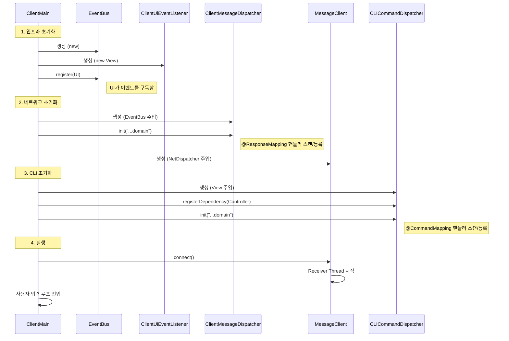
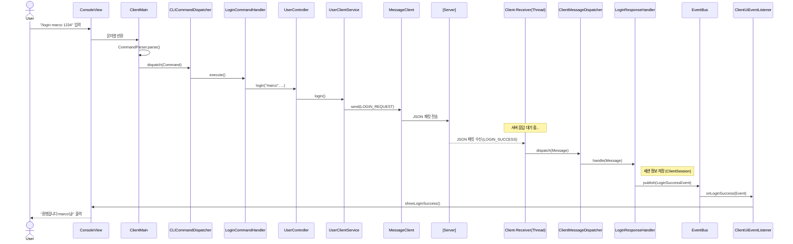

# 클라이언트 아키텍처 및 동작 흐름

이 문서는 메신저 클라이언트의 주요 구성 요소와 데이터 흐름을 시각화한 문서입니다.

## 1. 시스템 초기화 (Startup)

클라이언트 실행 시(`ClientMain`) 주요 컴포넌트들이 어떻게 생성되고 조립되는지 보여줍니다.

## 2. 로그인 프로세스 (Command to Response)

사용자가 `/login` 명령어를 입력했을 때, 요청이 서버로 가고 응답이 UI에 반영되기까지의 전체 흐름입니다.

## 핵심 아키텍처 결정 사항

### 1. 리플렉션 기반 Dispatcher
*   **이유**: 새로운 명령어(`/join`)나 메시지 타입(`CHAT`)이 추가될 때 `switch-case` 문을 수정하지 않고, 단순히 핸들러 클래스만 추가하면 자동으로 동작하게 하기 위함 (OCP 준수).
*   **구현**: `CLICommandDispatcher`와 `ClientMessageDispatcher`가 시작 시점에 패키지를 스캔하여 핸들러 맵을 구성함.

### 2. Observer 패턴 (EventBus)
*   **이유**: 네트워크 핸들러(`ResponseHandler`)가 UI(`View`)를 직접 참조하지 않게 하여 결합도를 낮추기 위함.
*   **동작**: 핸들러는 데이터 처리 후 `EventBus.publish()`만 호출하며, UI 업데이트는 `ClientUiEventListener`가 담당함. 이를 통해 UI 구현체가 변경되어도 비즈니스 로직은 영향을 받지 않음.

### 3. 가상 스레드 (Virtual Threads)
*   **이유**: Java 21의 기능을 활용하여, `MessageClient`의 수신 루프(`Receiver`)가 블로킹 I/O를 수행하더라도 물리적 스레드를 점유하지 않고 효율적으로 동작하게 함.
